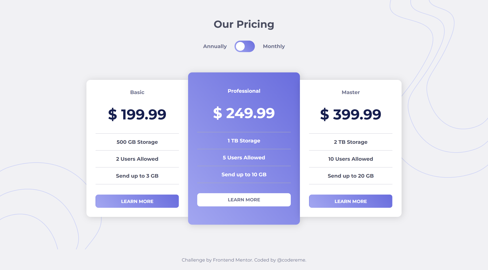

# Pricing component with toggle

This project is my solution to the "Pricing component with toggle" challenge from Frontend Mentor.

## Table of contents

- [Overview](#overview)
- [Screenshot](#screenshot)
- [Built with](#built-with)
- [Links](#links)
- [Author](#author)
- [Acknowledgments](#acknowledgments)

## Overview

## The challenge

Your challenge is to build out this pricing component and get it looking as close to the design as possible.

Your users should be able to:

- View the optimal layout for the component depending on their device's screen size
- Control the toggle with both their mouse/trackpad and their keyboard
- **Bonus**: Complete the challenge with just HTML and CSS

## Screenshot

## Built with

- Semantic HTML5 markup
- CSS Custom Properties
- Flexbox
- Mobile-first workflow
- JavaScript

## Links

- Live site: [View here](https://codereme.github.io/frontend-mentor-js-solutions-2/pricing-component-with-toggle/index.html)

## Author

- Frontend Mentor - [@codereme](https://www.frontendmentor.io/profile/codereme)
- Github - [@codereme](https://www.github.com/codereme)

## Acknowledgments

[Frontend Mentor](https://www.frontendmentor.io) for providing this challenge and helping developers improve their skills through realistic projects.
