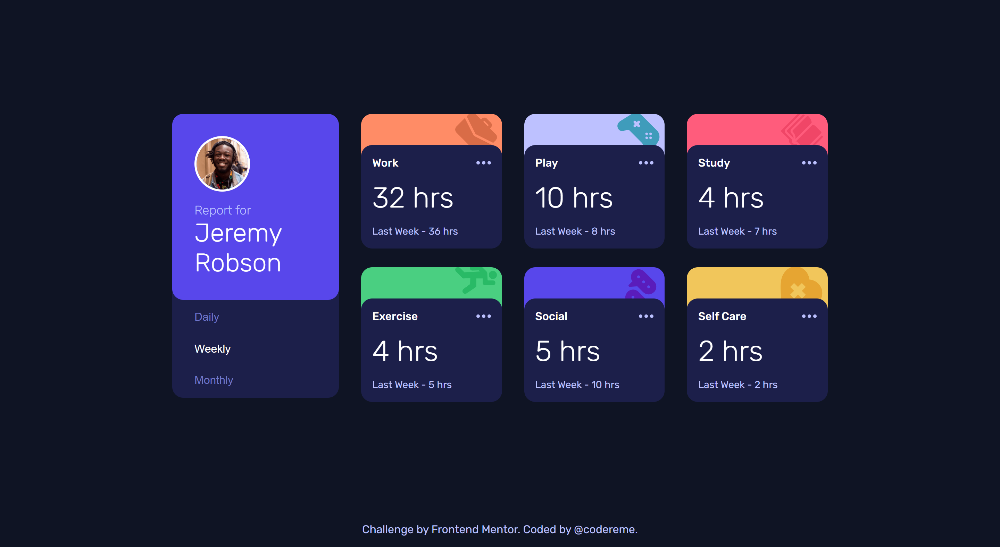

# Time Tracking Dashboard

This project is my solution to the "Time Tracking Dashboard" challenge from Frontend Mentor.

## Table of contents

- [Overview](#overview)
- [Screenshot](#screenshot)
- [Built with](#built-with)
- [Links](#links)
- [What I learned](#what-i-learned)
- [Author](#author)
- [Acknowledgments](#acknowledgments)

## Overview

## The challenge

Your challenge is to build out this dashboard and get it looking as close to the design as possible.

If you would like to practice working with JSON data, we provide a local `data.json` file for the activities. This means you'll be able to pull the data from there instead of using the content in the `.html` file.

Your users should be able to:

- View the optimal layout for the site depending on their device's screen size
- See hover states for all interactive elements on the page
- Switch between viewing Daily, Weekly, and Monthly stats

### Expected behaviour

- The text for the previous period's time should change based on the active timeframe. For Daily, it should read "Yesterday" e.g "Yesterday - 2hrs". For Weekly, it should read "Last Week" e.g. "Last Week - 32hrs". For monthly, it should read "Last Month" e.g. "Last Month - 19hrs".

## Screenshot

## Built with

- Semantic HTML5 markup
- CSS Custom Properties
- Flexbox
- CSS Grid
- Mobile-first workflow
- JavaScript

## Links

- Live site: [View here](https://codereme.github.io/frontend-mentor-js-solutions-2/time-tracking-dashboard/index.html)

## What I learned

After completing this challenge, my next lesson in [Javascript Fundamentals learning path](https://www.frontendmentor.io/learning-paths/javascript-fundamentals-oR7g6-mTZ-) is **Refactoring your code**. Through this project, I've already started applying key refactoring concepts:

- **Pure Functions**: Created reusable functions like `getPeriodText()` and `createCardHTML()`
- **State Management**: Implemented a centralized state object for data flow.
- **Event Delegation**: Used a single event listener on the container to handle multiple buttons efficiently.

I'll continue refactoring previous projects to explore different approaches and deepen my understanding of JavaScript fundamentals.

## Author

- Frontend Mentor - [@codereme](https://www.frontendmentor.io/profile/codereme)
- Github - [@codereme](https://www.github.com/codereme)

## Acknowledgments

[Frontend Mentor](https://www.frontendmentor.io) for providing this challenge and helping developers improve their skills through realistic projects.
